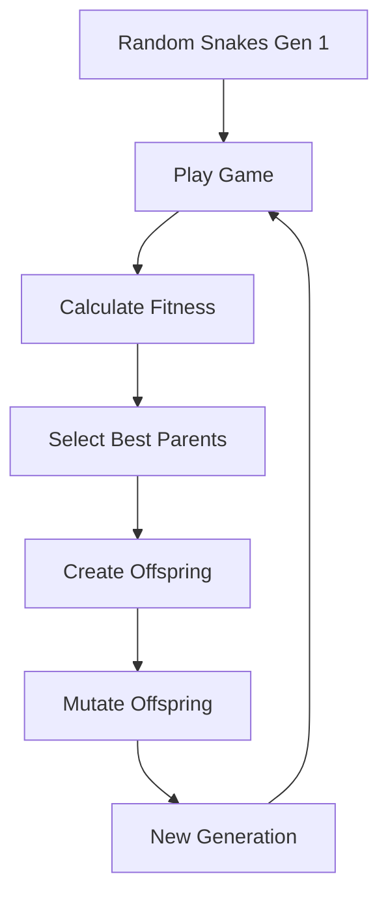

# Neural Snake AI Learning Visualizer

A visual demonstration of artificial intelligence learning to play Snake through neuroevolution - combining neural networks with genetic algorithms.

## Table of Contents
- [Overview](#overview)
- [Initial State - The Blank Slate](#initial-state---the-blank-slate)
- [How the AI Learns](#how-the-ai-learns)
- [Neural Network Architecture](#neural-network-architecture)
- [Vision System](#vision-system)
- [Genetic Algorithm](#genetic-algorithm)
- [Fitness Function](#fitness-function)
- [Component Breakdown](#component-breakdown)
- [Learning Stages](#learning-stages)
- [Technical Implementation](#technical-implementation)
- [UI Elements](#ui-elements)

## Overview

This project demonstrates how AI can learn to play Snake from scratch without any pre-programmed strategy. It uses:
- **Neural Networks**: The "brain" that makes decisions
- **Genetic Algorithms**: The evolution process that improves the brain
- **Real-time Visualization**: Shows what the AI "sees" and how it learns

## Initial State - The Blank Slate

### Generation 1: Complete Randomness
When the simulation starts, all 50 snakes begin with:

1. **Random Neural Networks**
   - Weights initialized using Xavier initialization: `±√(6/(input_nodes + output_nodes))`
   - This provides a good starting distribution, neither too small (no learning) nor too large (chaotic behavior)
   - Each snake has a unique random brain

2. **No Learned Behaviors**
   - Movement is essentially random
   - No understanding of walls, food, or self
   - Average survival time: ~5-20 steps
   - Typical score: 0-1 (lucky random food collision)

3. **Starting Position**
   - All snakes start at the center of the 15×15 grid
   - Initial direction: moving right
   - Length: 1 segment

## How the AI Learns

### The Learning Process



### Step-by-Step Learning:

1. **Playing Phase**
   - Each snake uses its neural network to decide movements
   - The network processes vision data and outputs direction probabilities
   - Snakes move until they die (hit wall/self) or timeout

2. **Evaluation Phase**
   - Each snake's performance is measured by the fitness function
   - Better performance = higher fitness = better chance to reproduce

3. **Selection Phase**
   - Tournament selection picks parents (not just the absolute best)
   - This maintains genetic diversity while favoring good traits

4. **Reproduction Phase**
   - Two parents create offspring through crossover
   - Neural network weights are mixed from both parents

5. **Mutation Phase**
   - Small random changes to weights (adaptive rate: starts high, decreases over time)
   - Prevents getting stuck in local optima
   - Enables discovery of new strategies

## Neural Network Architecture

### Network Structure
```
Input Layer (24 nodes) → Hidden Layer (20 nodes) → Output Layer (4 nodes)
```

### Input Layer: What the Snake "Sees"
The 24 inputs represent 8 vision rays, each detecting 3 things:

```
For each of 8 directions (N, NE, E, SE, S, SW, W, NW):
  - Distance to wall (inverse, normalized)
  - Distance to food (gradient, 0-1)
  - Distance to body (inverse, normalized)

Total: 8 directions × 3 sensors = 24 inputs
```

### Hidden Layer: Processing
- 20 neurons with Leaky ReLU activation
- Learns feature combinations like "food ahead + no wall"
- Leaky ReLU formula: `f(x) = x if x > 0, else 0.01x`
- Prevents "dead neurons" that stop learning

### Output Layer: Decision Making
- 4 neurons (Up, Right, Down, Left)
- Softmax activation converts to probabilities
- Highest probability determines movement direction
- Prevents 180° turns (would cause instant death)

## Vision System

### Ray Casting Visualization

```
        Wall Ray (white)
            ↑
    Body ← Snake → Food Ray (red)
    Ray     ↓
   (yellow) Wall

Each ray extends until it hits something
```

### Vision Ray Details:

1. **Wall Detection**
   - Returns: `1 / distance` when wall is hit
   - Closer walls = stronger signal
   - Helps learn wall avoidance

2. **Food Detection**
   - Returns: `1 - (distance / gridSize)` when food is found
   - Gradient signal: closer food = stronger signal
   - Critical improvement over binary detection

3. **Body Detection**
   - Returns: `1 / distance` for first body segment hit
   - Prevents self-collision
   - Becomes important as snake grows

### Why This Vision System?

- **Normalized Inputs**: All values 0-1 for stable learning
- **Gradient Information**: Snakes can sense "warmer/colder" to food
- **Spatial Awareness**: 8 directions give 360° awareness
- **Efficiency**: Minimal inputs while capturing essential information

## Genetic Algorithm

### Population Management
- **Population Size**: 50 snakes
- **Elitism**: Top 4 snakes copied directly to next generation
- **Diversity**: Tournament selection maintains variety

### Crossover (Reproduction)
```javascript
// Uniform crossover - each weight has 50% chance from each parent
childWeight = random() < 0.5 ? parent1Weight : parent2Weight
```

This creates children that inherit traits from both parents randomly.

### Mutation
```javascript
// Adaptive mutation rate decreases over time
mutationRate = 0.1 + (0.2 * e^(-generation/30))

// Mutation strength also decreases
mutationStrength = max(0.05, 0.2 * e^(-generation/50))

// Apply Gaussian noise
newWeight = oldWeight + (random(-1, 1) * mutationStrength)
```

**Why Adaptive?**
- Early generations: High mutation for exploration
- Later generations: Low mutation for fine-tuning

### Tournament Selection
```javascript
function tournamentSelection(population, tournamentSize = 5) {
    // Pick 5 random snakes
    // Return the best one
    // This maintains diversity better than always picking top snakes
}
```

## Fitness Function

### The Complete Fitness Formula
```javascript
fitness = scoreFitness + survivalFitness + explorationFitness + efficiencyPenalty
```

### Components Breakdown:

1. **Score Fitness**: `score^2.2 * 5000`
   - Exponential reward for eating food
   - Why ^2.2? Balances early vs late game progress
   - Eating 3 food is much better than eating 1

2. **Survival Fitness**: `lifeTime * 0.5`
   - Rewards staying alive
   - Encourages wall/self avoidance
   - Small multiplier to not overshadow food collection

3. **Exploration Fitness**: `stepsTowardFood * 2`
   - Rewards moving closer to food
   - Counts steps where distance to food decreased
   - Teaches food-seeking behavior

4. **Efficiency Penalty**: `-(totalDistanceToFood / lifeTime) * 10`
   - Penalizes aimless wandering
   - Average distance to food over lifetime
   - Encourages direct paths

### Step Limit Scaling
```javascript
stepLimit = 100 + (score * 50)
```
- Base: 100 steps to find first food
- +50 steps per food eaten
- Prevents infinite loops while allowing growth

## Component Breakdown

### Core Classes

#### 1. NeuralNetwork Class
**Purpose**: The snake's decision-making brain

**Key Methods**:
- `constructor(inputSize, hiddenSize, outputSize)`: Creates network architecture
- `randomizeWeights()`: Xavier initialization for stable training
- `predict(inputs)`: Forward propagation to get movement decision
- `mutate(rate, generation)`: Applies genetic mutations
- `crossover(partner)`: Creates offspring from two parents
- `copy()`: Creates exact duplicate for elitism

**Design Decisions**:
- Leaky ReLU activation: Prevents dead neurons
- Softmax output: Provides probability distribution
- Matrix operations: Efficient computation

#### 2. Snake Class
**Purpose**: Game entity that uses neural network to play

**Properties**:
- `brain`: Neural network instance
- `body`: Array of {x,y} positions
- `direction`: Current movement direction
- `fitness`: Performance score for evolution
- `visionRays`: What the snake currently sees

**Key Methods**:
- `think()`: Uses brain to decide next move
- `move()`: Executes movement and checks collisions
- `getInputs()`: Casts vision rays and prepares neural network inputs
- `calculateFitness()`: Evaluates performance for evolution

**Tracking Metrics**:
- `closestFoodDistance`: Best approach to food
- `stepsTowardFood`: Counts improving moves
- `totalDistanceToFood`: For efficiency calculation

### Visualization Components

#### 1. Best Snake View (Top Left)
**Shows**: Currently best performing snake with vision rays
- Red rays: Food detection
- Yellow rays: Body detection  
- White rays: Wall detection
- Green snake: Alive and moving
- Numbers: Neural network confidence for each direction

#### 2. Population Overview (Top Right)
**Shows**: All 50 snakes in miniature
- Green dots: Living snakes
- Red dots: Dead snakes
- Helps visualize population survival rates

#### 3. Learning Progress Graph (Bottom)
**Shows**: Performance over generations
- Green line: Best score achieved
- Blue line: Population average
- X-axis: Generation number
- Y-axis: Score (food eaten)

#### 4. Neural Network Visualizer
**Shows**: Real-time brain activity
- Node size: Activation strength
- Hidden layer: Feature detection
- Output layer: Direction probabilities

### Control System

1. **Start/Pause/Resume**: Control simulation flow
2. **Reset**: Start fresh with new random population
3. **Skip Generation**: Fast-forward if all snakes seem stuck
4. **Speed Control**: 1-60 FPS for different viewing speeds

## Learning Stages

### Stage 1: Early (Generation 1-20)
**Characteristics**:
- Random, chaotic movement
- Frequent wall collisions
- Occasional lucky food finds
- Scores: 0-3

**What's Being Learned**:
- Basic wall avoidance
- Not turning 180°
- Survival instincts

### Stage 2: Learning (Generation 20-100)
**Characteristics**:
- Deliberate movement patterns
- Active food seeking
- Better survival times
- Scores: 4-15

**What's Being Learned**:
- Food direction sensing
- Path planning basics
- Self-avoidance (as they grow)

### Stage 3: Advanced (Generation 100+)
**Characteristics**:
- Efficient food collection
- Smooth movement
- Long survival times
- Scores: 20+

**What's Being Learned**:
- Optimal paths to food
- Complex self-avoidance
- Risk assessment

## Technical Implementation

### Performance Optimizations

1. **Efficient Vision System**
   - Pre-calculated ray directions
   - Early termination on hit
   - Single pass detection

2. **Neural Network**
   - Matrix batch operations
   - Cached computations
   - Minimal memory allocation

3. **Rendering**
   - Only redraw changed elements
   - RequestAnimationFrame for smooth 60fps
   - Separate canvases for different views

### Browser Technologies Used
- **Canvas API**: All visualizations
- **RequestAnimationFrame**: Smooth game loop
- **ES6 Features**: Classes, arrow functions, destructuring

### Why These Design Choices?

1. **24 Inputs Instead of Full Grid**
   - Full 15×15 grid = 225 inputs (too complex)
   - Ray casting = 24 inputs (efficient and effective)
   - Captures essential information

2. **Population of 50**
   - Large enough for genetic diversity
   - Small enough for real-time simulation
   - Good balance for learning speed

3. **Gradient Food Detection**
   - Binary (yes/no) = snakes can't learn direction
   - Gradient (closer = stronger) = enables pathfinding

4. **Adaptive Mutation**
   - Fixed rate = too slow or too chaotic
   - Adaptive = explores early, refines later

## Running the Simulation

1. **Open the HTML file in a modern browser**
2. **Click "Start Learning"**
3. **Watch the AI evolve!**

### What to Look For:
- Generation 1-10: Wall bouncing, random deaths
- Generation 10-30: First consistent food finders
- Generation 30-50: Emergence of strategies
- Generation 50+: Refined, efficient movement

### Tips for Observation:
- Use speed control to slow down interesting moments
- Watch the vision rays to understand decisions
- Monitor the neural network activity
- Compare early vs late generation behaviors

## Conclusion

This project demonstrates how complex behaviors can emerge from simple rules through evolution. The snakes start knowing nothing and gradually learn to:
1. Avoid walls
2. Seek food
3. Avoid their own body
4. Plan efficient paths

All through the process of random mutation and natural selection - the same forces that drive biological evolution!
